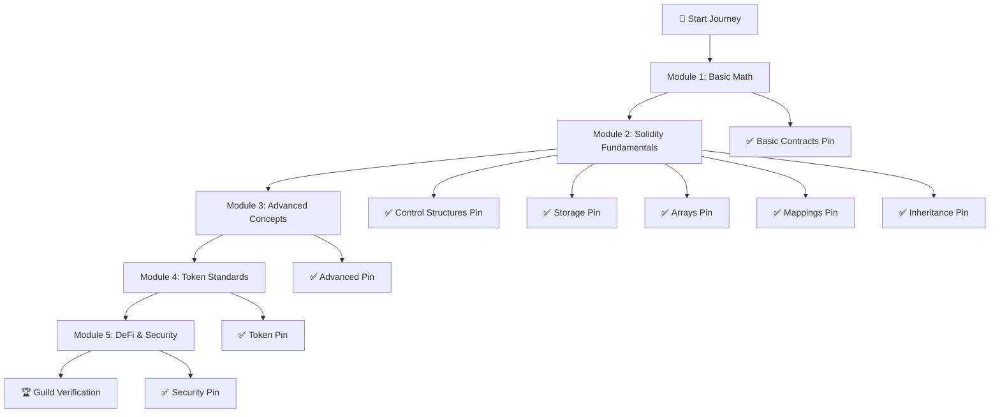
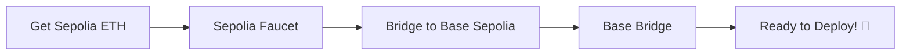
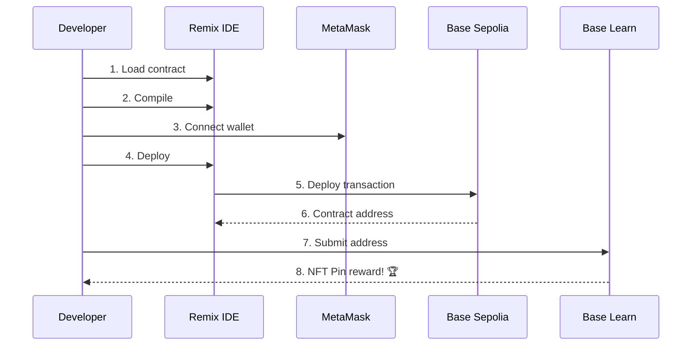
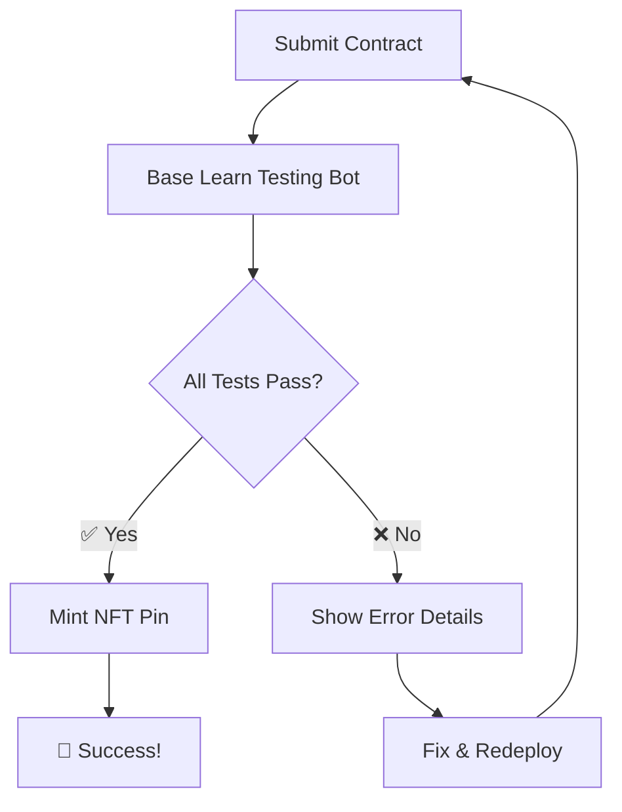

# 🏗️ Base Learn Complete Journey

<div align="center">


**Complete all Base Learn modules and earn exclusive NFT pins! 🏆**

[🚀 Get Started](#-quick-start) • [📚 Documentation](#-modules-overview) • [🎯 Deployment](#-deployment-guide) • [🏆 Guild Verification](#-guild-verification)

</div>

---

## 📋 Table of Contents

- [🎯 Overview](#-overview)
- [🏆 Achievements](#-achievements)
- [🚀 Quick Start](#-quick-start)
- [📋 Prerequisites](#-prerequisites)
- [📚 Modules Overview](#-modules-overview)
- [🎯 Deployment Guide](#-deployment-guide)
- [🧪 Testing](#-testing)
- [🏆 Guild Verification](#-guild-verification)
- [🛠️ Troubleshooting](#️-troubleshooting)
- [🤝 Contributing](#-contributing)
- [📄 License](#-license)

---

## 🎯 Overview

This repository contains **complete solutions** for all [Base Learn](https://docs.base.org/base-learn/) modules. Base Learn is Coinbase's educational platform for learning Solidity and smart contract development on Base blockchain.

### 🎨 What You'll Build



---

## 🏆 Achievements

<div align="center">

| Module | Contract | NFT Pin | Status |
|--------|----------|---------|--------|
| **1** | BasicMath | 🥉 Basic Contracts | ✅ Ready |
| **2.1** | ControlStructures | 🎮 Control Flow | ✅ Ready |
| **2.2** | EmployeeStorage | 💾 Storage | ✅ Ready |
| **2.3** | ArraysExercise | 📊 Arrays | ✅ Ready |
| **2.4** | FavoriteRecords | 🗺️ Mappings | ✅ Ready |
| **2.5** | Inheritance Suite | 🏗️ Inheritance | ✅ Ready |
| **3.1** | GarageManager | 🚗 Structs | ✅ Ready |
| **3.2** | ImportsExercise | 📦 Imports | ✅ Ready |
| **3.3** | ErrorTriage | 🐛 Debugging | ✅ Ready |
| **3.4** | AddressBookFactory | 🏭 Factory Pattern | ✅ Ready |
| **4.1** | UnburnableToken | 🪙 Simple Token | ✅ Ready |
| **4.2** | WeightedVoting | ⚖️ ERC-20 | ✅ Ready |
| **4.3** | HaikuNFT | 🎋 ERC-721 | ✅ Ready |

**🎯 Final Goal**: [Guild.xyz Base Learn Verification](https://guild.xyz/base/base-learn)

</div>

---

## 🚀 Quick Start

### 🛠️ Option 1: Clone & Deploy (Recommended)

```bash
# 1️⃣ Clone this repository
git clone https://github.com/your-username/base-learn-complete.git
cd base-learn-complete

# 2️⃣ Open Remix IDE
# Visit: https://remix.ethereum.org/

# 3️⃣ Import contracts folder
# Drag and drop the contracts/ folder into Remix

# 4️⃣ Deploy to Base Sepolia
# Follow deployment guide below
```

### ⚡ Option 2: Individual Contracts

Navigate to specific contract files in the `/contracts` folder and copy-paste into Remix.

---

## 📋 Prerequisites

<div align="center">

### 🔧 Development Tools

| Tool | Purpose | Link |
|------|---------|------|
| 🌐 **Remix IDE** | Smart Contract Development | [remix.ethereum.org](https://remix.ethereum.org/) |
| 🦊 **MetaMask** | Wallet & Network Connection | [metamask.io](https://metamask.io/) |
| 🌉 **Base Bridge** | Testnet ETH | [bridge.base.org](https://bridge.base.org/) |

</div>

### 🌐 Network Configuration: Base Sepolia

```javascript
Network Name: Base Sepolia
RPC URL: https://sepolia.base.org
Chain ID: 84532
Currency Symbol: ETH
Block Explorer: https://sepolia.basescan.org
```

### 💰 Get Testnet ETH



1. **Get Sepolia ETH**: [sepoliafaucet.com](https://sepoliafaucet.com/)
2. **Bridge to Base Sepolia**: [bridge.base.org](https://bridge.base.org/)

---

## 📚 Modules Overview

<details>
<summary>🥉 <strong>Module 1: Basic Functions</strong></summary>

### 🎯 BasicMath Contract
**File**: `/contracts/01-basic-functions/BasicMath.sol`

**Features:**
- ✅ Overflow-safe addition
- ✅ Underflow-safe subtraction  
- ✅ Boolean error flags

**Test Cases:**
```solidity
adder(1, 2) → (3, false)         // Normal addition
adder(1, MAX_INT) → (0, true)    // Overflow detection
subtractor(2, 1) → (1, false)    // Normal subtraction  
subtractor(1, 2) → (0, true)     // Underflow detection
```

**Deployment:**
```bash
1. Deploy BasicMath.sol to Base Sepolia
2. Test all 4 functions
3. Submit contract address to Base Learn
4. Earn Basic Contracts Pin 🥉
```

</details>

<details>
<summary>🎮 <strong>Module 2: Solidity Fundamentals (5 Exercises)</strong></summary>

### 2.1 🎮 Control Structures
**File**: `/contracts/02-solidity-fundamentals/ControlStructures.sol`

**Features:**
- ✅ FizzBuzz implementation
- ✅ Time-based access control
- ✅ Custom errors

### 2.2 💾 Storage Optimization  
**File**: `/contracts/02-solidity-fundamentals/EmployeeStorage.sol`

**Features:**
- ✅ Gas-efficient storage packing
- ✅ Employee data management
- ✅ Shares allocation system

### 2.3 📊 Arrays Management
**File**: `/contracts/02-solidity-fundamentals/ArraysExercise.sol`

**Features:**
- ✅ Dynamic array operations
- ✅ Timestamp filtering
- ✅ Address tracking

### 2.4 🗺️ Mappings & Data
**File**: `/contracts/02-solidity-fundamentals/FavoriteRecords.sol`

**Features:**
- ✅ Nested mappings
- ✅ Music collection management
- ✅ Approval system

### 2.5 🏗️ Inheritance System
**Files**: 
- `/contracts/02-solidity-fundamentals/Inheritance.sol`
- `/contracts/02-solidity-fundamentals/InheritanceSubmission.sol`

**Features:**
- ✅ Abstract contracts
- ✅ Multiple inheritance  
- ✅ Constructor chaining

**Special Deployment:**
```bash
1. Deploy Salesperson(55555, 12345, 20)
2. Deploy EngineeringManager(54321, 11111, 200000)
3. Deploy InheritanceSubmission(addr1, addr2)
4. Submit final address
```

</details>

<details>
<summary>🚗 <strong>Module 3: Advanced Concepts</strong></summary>

### 3.1 🚗 Structs & Complex Data
**File**: `/contracts/03-advanced-concepts/GarageManager.sol`

### 3.2 📦 Imports & Libraries  
**Files**: 
- `/contracts/03-advanced-concepts/SillyStringUtils.sol`
- `/contracts/03-advanced-concepts/ImportsExercise.sol`

### 3.3 🐛 Error Debugging
**File**: `/contracts/03-advanced-concepts/ErrorTriageExercise.sol`

### 3.4 🏭 Factory Pattern
**Files**:
- `/contracts/03-advanced-concepts/AddressBook.sol`
- `/contracts/03-advanced-concepts/AddressBookFactory.sol`

</details>

<details>
<summary>🪙 <strong>Module 4: Token Standards</strong></summary>

### 4.1 🪙 Simple Token
**File**: `/contracts/04-token-standards/UnburnableToken.sol`

### 4.2 ⚖️ ERC-20 Voting Token
**File**: `/contracts/04-token-standards/WeightedVoting.sol`

### 4.3 🎋 ERC-721 NFT
**File**: `/contracts/04-token-standards/HaikuNFT.sol`

**Features:**
- ✅ Unique haiku validation
- ✅ NFT sharing system
- ✅ Poetry on blockchain

</details>

---

## 🎯 Deployment Guide

### 🔄 Standard Deployment Process



### 📝 Step-by-Step Instructions

<details>
<summary><strong>🔧 1. Environment Setup</strong></summary>

1. **Open Remix**: [remix.ethereum.org](https://remix.ethereum.org/)
2. **Connect MetaMask**: Ensure Base Sepolia network is added
3. **Check ETH Balance**: Ensure you have testnet ETH for gas
4. **Import Contracts**: Copy contract files into Remix

</details>

<details>
<summary><strong>⚡ 2. Compilation</strong></summary>

```bash
1. Select Solidity Compiler tab
2. Set compiler version: ^0.8.17
3. Click "Compile [ContractName].sol"
4. Verify green checkmark (no errors)
```

</details>

<details>
<summary><strong>🚀 3. Deployment</strong></summary>

```bash
1. Navigate to "Deploy & Run Transactions"
2. Environment: "Injected Provider - MetaMask"
3. Select contract from dropdown
4. Enter constructor parameters (if needed)
5. Click "Deploy"
6. Confirm MetaMask transaction
7. Copy deployed contract address
```

</details>

<details>
<summary><strong>✅ 4. Verification & Testing</strong></summary>

```bash
1. Test contract functions in Remix
2. Verify expected outputs
3. Check contract on BaseScan
4. Screenshot successful tests
```

</details>

<details>
<summary><strong>📤 5. Submission</strong></summary>

```bash
1. Visit Base Learn exercise page
2. Enter contract address
3. Submit for automated testing
4. Wait for NFT pin mint
5. Verify in MetaMask/OpenSea
```

</details>

---

## 🧪 Testing

### 🔍 Pre-Deployment Testing

Each contract includes comprehensive test scenarios:

<details>
<summary><strong>🧮 BasicMath Tests</strong></summary>

```solidity
// Test normal operations
adder(1, 2) → expect: (3, false)
subtractor(2, 1) → expect: (1, false)

// Test edge cases  
adder(1, 2^256-1) → expect: (0, true)    // Overflow
subtractor(1, 2) → expect: (0, true)     // Underflow
```

</details>

<details>
<summary><strong>🎋 HaikuNFT Tests</strong></summary>

```solidity
// Test minting
mintHaiku("Spring rain falling", "Cherry blossoms bloom", "Nature awakens")
→ expect: NFT minted successfully

// Test uniqueness
mintHaiku("Spring rain falling", "Different line", "Different ending")  
→ expect: revert HaikuNotUnique()

// Test sharing
shareHaiku(friendAddress, 1)
→ expect: Added to shared mapping
```

</details>

### 🎯 Automated Testing

Base Learn runs automated tests against your deployed contracts:



---

## 🏆 Guild Verification

### 🎯 Final Goal: Guild.xyz Access

Once you've earned **all required NFT pins**, you can join the exclusive [Base Learn Guild](https://guild.xyz/base/base-learn).

### ✅ Requirements Checklist

```markdown
Required NFT Pins (Hold Base Learn Pins 1-4):
- [ ] 🥉 Basic Contracts Pin (Module 1)
- [ ] 🎮 Control Structures Pin (Module 2.1)  
- [ ] 💾 Storage Pin (Module 2.2)
- [ ] 📊 Arrays Pin (Module 2.3)
- [ ] 🗺️ Mappings Pin (Module 2.4)
- [ ] 🏗️ Inheritance Pin (Module 2.5)
```

### 🔗 Guild Verification Steps

```mermaid
graph LR
    A[Complete All Modules] --> B[Collect NFT Pins]
    B --> C[Visit Guild.xyz]
    C --> D[Connect Wallet]
    D --> E[Automatic Verification]
    E --> F[🎉 Welcome to Guil